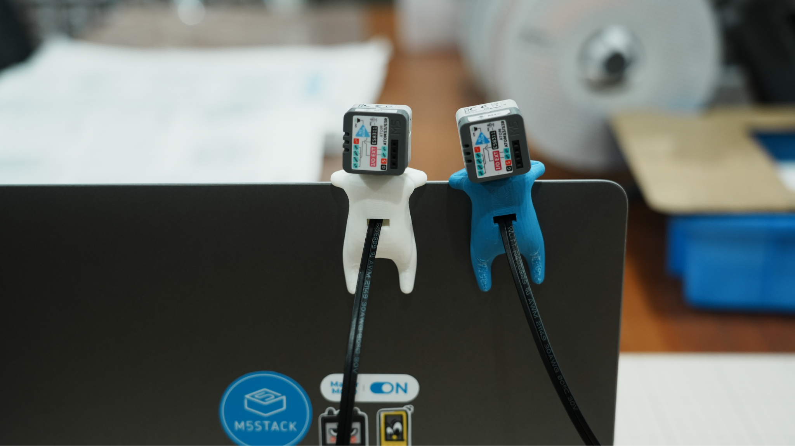

# Xiaozhi Avatar Face
## 介绍

本项目基于虾哥开源的 ESP32 小智语音助手进行二次开发。硬件使用 M5Stack AtomS3R + Atomic Echo Base 搭配结构设计，修改显示表情包为 M5Stack Avatar Face。

## 硬件

- [AtomS3R](https://docs.m5stack.com/en/products/sku/C126)
- [Atomic Echo Base](https://docs.m5stack.com/en/products/sku/C126)

## 相关开源项目

- [xiaozhi-esp32](https://github.com/78/xiaozhi-esp32)
- [m5stack-avatar](https://github.com/stack-chan/m5stack-avatar)
- [M5Unified](https://github.com/m5stack/M5Unified)
- [M5GFX](https://github.com/m5stack/M5GFX)
